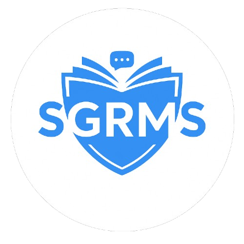

  

<h1 align="center">School Guidance Record Management System</h1>

  A centralized, web-based platform for record-keeping, appointment scheduling, and secure communication.

  
  
  
  
  

---

## ✨ What is SGRMS?

Guidance and counseling offices play a critical role in supporting students' academic, emotional, and personal development. However, relying on traditional paper-based systems often results in misplaced documents, scheduling conflicts, and limited data accessibility.

Many institutions rely on paper folders for counseling notes, handwritten logbooks for appointments, and third-party apps like Messenger for communication.

**SGRMS fixes that.** Designed specifically for **Montessori Academy Southern Cebu, Inc. (MASCI)**, SGRMS digitizes core guidance operations into a unified, highly secure, and accessible web-based platform.

---

## 🚀 What It Does

* **Centralizes Record Management:** Digitizes student records, case files, and session documentation with fast access control.
* **Automates Appointment Scheduling:** Replaces physical logbooks with an interactive digital calendar interface for scheduling and tracking counseling sessions.
* **Provides AI Assistance:** Integrates **Gabby**, a Retrieval-Augmented Generation (RAG) chatbot designed to handle school policy and guidance inquiries.
* **Secures Communication:** Features a built-in internal messaging module to eliminate reliance on external third-party messaging apps.

---

## 🎛️ Features by User Role

SGRMS uses **Role-Based Access Control (RBAC)** to restrict system functions based on assigned responsibilities:

| User Role | Key Capabilities & Features |
| :--- | :--- |
| **School Principal** *(Admin)* | Full system oversight, account management, parent-student child-linking approval, full case review, and official announcement broadcasting. |
| **Guidance Counselors** | Session documentation, appointment calendar management, case reporting, and direct messaging with students and parents. |
| **Parents / Guardians** | Appointment booking, secure messaging with guidance staff, receiving school alerts, and access to the **Gabby AI Assistant**. |
| **Students** | Viewing appointment schedules, direct communication with counselors, receiving updates, and asking policy questions via the AI chatbot. |

---

## 🤖 AI Assistant: Gabby (RAG Chatbot)

SGRMS includes an integrated chatbot named **Gabby**, powered by a **Retrieval-Augmented Generation (RAG)** architecture:
* **Knowledge Scope:** Answers predefined inquiries regarding school policies and guidance services.
* **Grounding:** Combines database retrieval with text generation to ensure answers remain strictly accurate and contextual.
* *Note: Gabby is strictly designed for administrative/policy Q&A and does not perform psychological evaluations or emotional counseling.*

---

## 🔐 Security & Data Privacy

To protect sensitive guidance records and student case files, SGRMS implements strict enterprise-grade security controls:

* **Two-Factor Authentication (2FA):** Supports TOTP-based authentication (e.g., Google Authenticator) for user logins.
* **Data Encryption:** Converts sensitive records and transmitted messages into encrypted formats to prevent unauthorized access.
* **Role-Based Access Control (RBAC):** Ensures users only see data explicit to their permission level.
* **Parent Verification:** Requires formal principal verification ("Child Linking") before parents can view a student profile.

---

## 📱 System Screenshots

  
  
  
  

---

## ⚠️ Scope & System Boundaries

To set clear operational expectations, SGRMS is bounded by the following parameters:

* **Independent System:** Operates as a dedicated platform for guidance operations and is not integrated with external academic management systems.
* **Document Limitations:** Does not issue official academic documents (e.g., report cards, transcripts, or certificates).
* **Notification Channels:** Delivers updates strictly via **In-System Alerts** and **Email** (SMS notifications are not supported).

---

## 📝 Notes

> ⚠️ **Project Context & Development Status**
>
> **SGRMS** was proposed and developed as a capstone project for **Montessori Academy Southern Cebu, Inc. (MASCI)** between **July 2025 and November 2025**. 
>
> The system serves as an academic case study documenting technological integration and digital workflow transformation in educational guidance operations.

---

  <i>Developed for Montessori Academy Southern Cebu, Inc. (MASCI) Guidance Office.</i>

